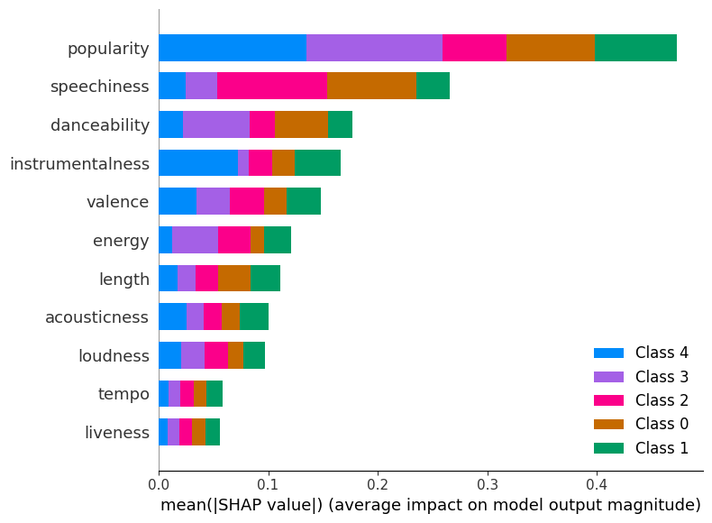

# Spotify-Popularity-Prediction

Explored machine learning algorithms to best predict popularity of songs of the top Spotify artists as well as predicting which artist belongs to a song based on the song's features. Machine learning models include linear regression, logistic regression, decision trees, k-nearest-neighbors, SVMs, and neural networks. For both tasks, the neural network performed the best. For predicting the popularity score, the neural network with 5 polynomial features has an R-squared of 0.70. For predicting the artist, the neural network also with 5 polynomial features has an accuracy of 0.92. The data was upscaled since Taylor Swift had far more songs than all of the other artists. Using shap feature values, popularity is the best predictive feature of which artist a song is by, and liveness is least predictive.

